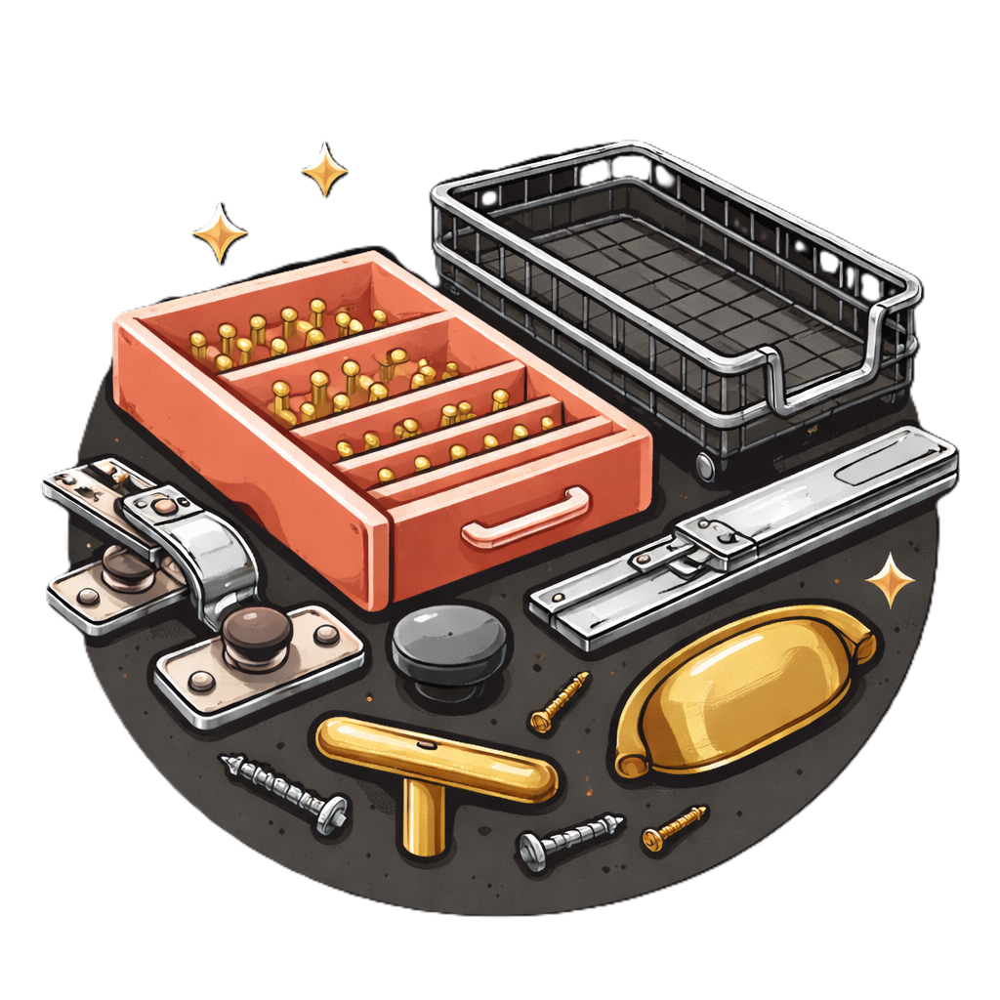
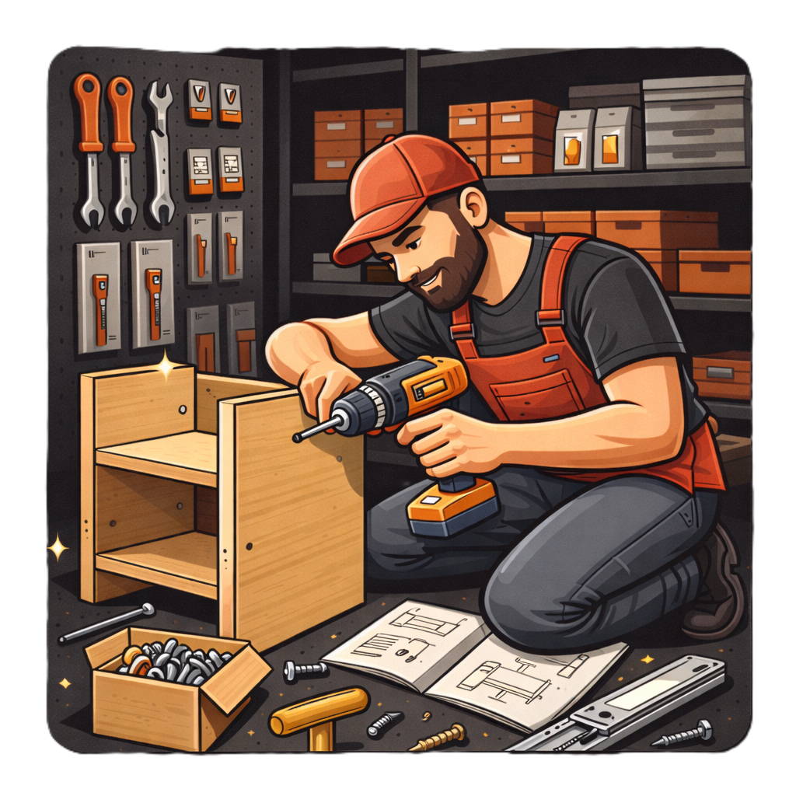

# Creación de Herrajes

Este módulo de Cabinet Report le ofrece 3 secciones de Herrajes para poder organizar mejor sus reportes al departamento de Almacén:

<figure><figcaption></figcaption></figure>


{% column width="33.33333333333333%" %}

<figure><figcaption></figcaption></figure>



{% column width="66.66666666666667%" %}
[<mark style="color:$primary;">**Accesorios**</mark>](accesorios.md)

Acá se agrupa todos los herrajes que entren bajo esta categoría.

_<mark style="color:$primary;">Los accesorios son los elementos especiales que le añaden funcionalidad a su mueble.</mark>_




{% column width="33.33333333333333%" %}

<figure><figcaption></figcaption></figure>



{% column width="66.66666666666667%" %}
[<mark style="color:$primary;">**Ferretería de Montaje**</mark>](ferreteria-de-montaje.md)

Acá se agrupa todos los herrajes que entren bajo esta categoría.

_<mark style="color:$primary;">Son los herrajes que se utilizan para el armado de los muebles en la fábrica</mark>_




{% column width="33.33333333333333%" %}

<figure><figcaption></figcaption></figure>



{% column width="66.66666666666667%" %}
[<mark style="color:$primary;">**Ferretería de Instalación**</mark>](/broken/pages/qs3tnPhMpNx08IUa7lkp)

Acá se agrupa todos los herrajes que entren bajo esta categoría.

_<mark style="color:$primary;">Son los herrajes que se utilizan para instalar los muebles en campo.</mark>_



***

Puede acceder a los herrajes desde:

<mark style="color:$primary;">**Menú Herraje:**</mark> Para crear, eliminar, modificar los herrajes de la base de datos.

<mark style="color:$primary;">**Creador de Módulos:**</mark> Para agregar herrajes a los módulos que está creando en el catálogo de módulos.

<mark style="color:$primary;">**Catálogo:**</mark> Para ver los herrajes asignado al módulo del catálogo, asignar nuevos o eliminar existentes.

<mark style="color:$primary;">**Reporte de Producción:**</mark> Para agregar mas herrajes a la producción en la que se está trabajando.
