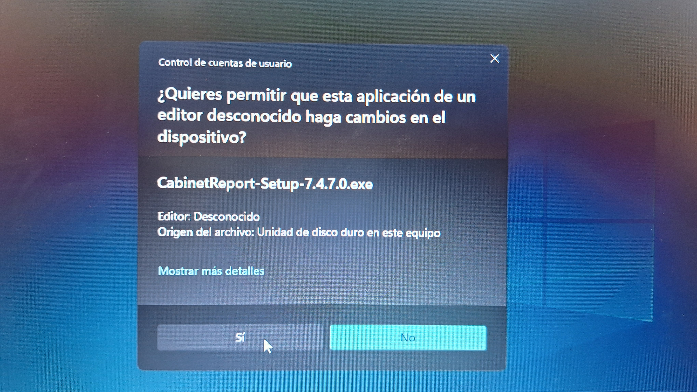

# Instalar Actualizaciones

Mantener Cabinet Report actualizado es importante para trabajar con mejoras recientes, correcciones del sistema y un funcionamiento más estable.

En esta sección encontrará el proceso para instalar cada actualización disponible.

Cada vez que exista una versión más reciente que la instalada, la aplicación mostrará una notificación para actualizar.

### 1. Iniciar sesión

Al iniciar Cabinet Report, aparecerá la pantalla de inicio de sesión:

<figure><figcaption></figcaption></figure>

Después de iniciar sesión, si existe una actualización disponible, aparecerá una ventana notificando la nueva versión:

<figure><figcaption></figcaption></figure>

### 2. Iniciar la actualización

Para mantener la aplicación actualizada y trabajar con la última versión, haga clic en el botón **Actualizar**:

<figure><figcaption></figcaption></figure>

### 3. Descargar la actualización

Iniciará el proceso de descarga de la aplicación actualizada:

<figure><figcaption></figcaption></figure>

### 4. Autorizar la instalación

Al finalizar la descarga, deberá otorgar permisos para continuar con la instalación:

<figure><figcaption></figcaption></figure>

Si no se acepta el permiso, no se instalará la actualización.

### 5. Conservar la licencia instalada

Una vez aceptado el permiso, aparecerá la siguiente ventana. Debe indicar que desea mantener la licencia instalada, ya que se trata de una actualización y no de una instalación nueva:

<figure><figcaption></figcaption></figure>

### 6. Finalizar el proceso

Luego iniciará la instalación. La aplicación se cerrará automáticamente. Después, deberá abrirla nuevamente desde el ícono del escritorio:

<figure><figcaption></figcaption></figure>

Después de abrirla, la aplicación ya estará actualizada.

Este proceso debe realizarse de la misma manera cada vez que exista una nueva actualización.
