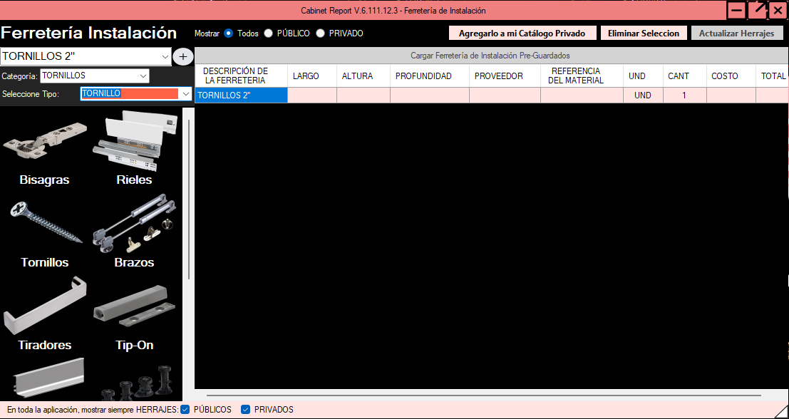

# Orden de Producción

<figure><figcaption></figcaption></figure>

<mark style="color:red;">**`Esta funcionalidad está en desarrollo y pronto estará lista para que la pueda utilizar`**</mark>

El documento de Orden de Producción es el control de sus procesos de producción en la fábrica y campo.


{% column width="58.333333333333336%" %}
Haga clic en&#x20;

<kbd><mark style="color:$primary;">Agregar Reporte de Producción<mark style="color:$primary;"></kbd>


{% column width="41.666666666666664%" %}
<figure><figcaption></figcaption></figure>



Seleccione el archivo XLSX de Producción - RP y haga clic en <kbd><mark style="color:$primary;">Abrir<mark style="color:$primary;"></kbd>:

<figure><figcaption></figcaption></figure>


{% column width="41.66666666666667%" %}
Si el archivo esta correcto le saldrá el mensaje de éxito.

También puede agregar otros archivos del mismo cliente si se van a cortar juntos.


{% column width="58.33333333333333%" %}
<figure><figcaption></figcaption></figure>



Le aparecerán la lista de materiales y la lista de RP seleccionados que va a cortar juntos bajo una misma <mark style="color:$primary;">Orden de Producción</mark>.

<figure><figcaption></figcaption></figure>

Entre la informacion puede destacar:



<figure><figcaption></figcaption></figure>

El Número de Control de OP



La cantidad de piezas que contiene la Producción entre todos los RP

<figure><figcaption></figcaption></figure>



La lista de Aglomerados y Cantos:

<figure><figcaption></figcaption></figure>

Y la lista de RPs seleccionados:

<figure><figcaption></figcaption></figure>


{% column width="66.66666666666666%" %}
Haga Clic en

<kbd><mark style="color:$primary;">Generar Reporte de Producción<mark style="color:$primary;"></kbd>


{% column width="33.33333333333334%" %}
<figure><figcaption></figcaption></figure>



Seleccione la ubicación donde guardará la Orden de Producción, preferiblemente dentro de la misma carpeta donde estan los archivos de su producción:

<figure><figcaption></figcaption></figure>


{% column width="33.33333333333333%" %}
Si todo sale bien le sale el mensaje de éxito


{% column width="66.66666666666667%" %}

<figure><figcaption></figcaption></figure>




## <mark style="color:$primary;">**Que más funciones tiene esta sección?**</mark>


{% column width="41.66666666666667%" %}
También puede convertir archivos entre Optimizadores, por ahora entre los 2 optimizadores creados


{% column width="58.33333333333333%" %}

<figure><figcaption></figcaption></figure>




Por ultimo puede fusionar o seprar optimizaciones:

<figure><figcaption></figcaption></figure>

Esto por si va a cortar 2 producciones con el mismo material, desde aquí Cabinet Report con un solo clic le unifica las piezas en un solo archivo.
